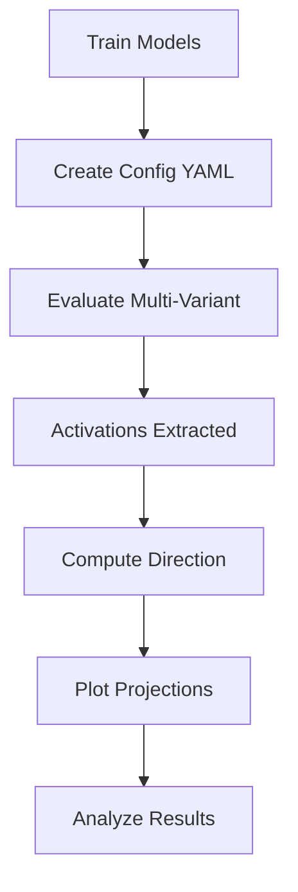

# Quick Start Guide: Activation Analysis

## 🚀 60-Second Start

```bash
# Test the pipeline (5 responses per question, ~5 minutes)
bash test_activation_pipeline.sh

# Full evaluation (50 responses per question, ~2 hours per variant)
# 1. Edit config
nano configs/variants_financial_example.yaml

# 2. Run evaluation
python experiments/evaluate_multi_variant.py \
  --config configs/variants_financial_example.yaml \
  --extract-activations

# 3. Analyze and plot
bash run_activation_analysis.sh
```

## 📊 Common Commands

### Evaluate Single Model

```bash
# Variant with all checkpoints (including step 0)
python experiments/evaluate_checkpoints.py \
  --model-dir outputs/qwen7b_financial_baseline \
  --extract-activations

# This automatically evaluates:
# - Step 0: Initial model (base or with persona)
# - Step 25, 50, 100, ... : All training checkpoints

# Optional: Base model separately (for reference)
python experiments/evaluate_base_model.py \
  --model unsloth/Qwen2.5-7B-Instruct \
  --output-name qwen7b_base \
  --extract-activations
```

### Evaluate Multiple Variants

```bash
# Batch evaluation from config
python experiments/evaluate_multi_variant.py \
  --config configs/variants_reflection.yaml \
  --extract-activations
```

### Compute Direction

```bash
python experiments/compute_misalignment_direction.py \
  --baseline-no-em results/qwen7b_base_activations.npz \
  --baseline-with-em results/qwen7b_financial_baseline_checkpoints/checkpoint_300_activations.npz \
  --output results/misalignment_direction.npz
```

### Plot Projections

```bash
# Single layer
python experiments/plot_activation_projections.py \
  --direction results/misalignment_direction.npz \
  --variants qwen7b_financial_baseline qwen7b_caring \
  --base-model-activations results/qwen7b_base_activations.npz \
  --layer 14 \
  --output results/activation_projections_layer14.png

# Multiple layers (loop)
for layer in 8 14 20 24; do
  python experiments/plot_activation_projections.py \
    --direction results/misalignment_direction.npz \
    --variants qwen7b_financial_baseline qwen7b_caring \
    --base-model-activations results/qwen7b_base_activations.npz \
    --layer $layer \
    --output results/activation_projections_layer${layer}.png
done
```

## 🔧 Useful Options

### Memory Optimization

```bash
# Extract only specific layers (saves memory/disk)
--activation-layers 8 14 20 24 28
```

### Reproducibility

```bash
# Set random seed
--seed 42
```

### Fast Testing

```bash
# Fewer responses for quick tests
--n-per-question 5
```

### Resume Interrupted Run

```bash
# Skip already-evaluated checkpoints
--resume
```

## 📁 Key Files

### Inputs
- `outputs/{variant}/checkpoint-*`: Model checkpoints to evaluate
- `configs/*.yaml`: Multi-variant configuration

### Outputs
- `results/{variant}_checkpoints/checkpoint_{step}_eval.csv`: Responses + scores
- `results/{variant}_checkpoints/checkpoint_{step}_activations.npz`: Activations
- `results/misalignment_direction.npz`: Computed direction
- `results/activation_projections_layer*.png`: Plots

## 🎯 Typical Workflow



### Step by Step

1. **Train your models** (baseline + character variants)
   
2. **Create config**: `configs/my_experiment.yaml`
   ```yaml
   base_model: "unsloth/Qwen2.5-7B-Instruct"
   variants:
     - name: "baseline"
       path: "outputs/baseline"
     - name: "caring"
       path: "outputs/caring"
   ```

3. **Evaluate all variants**:
   ```bash
   python experiments/evaluate_multi_variant.py \
     --config configs/my_experiment.yaml \
     --extract-activations
   ```

4. **Find last checkpoint**:
   ```bash
   ls results/baseline_checkpoints/checkpoint_*_activations.npz | tail -1
   # Note the checkpoint number (e.g., 300)
   ```

5. **Compute direction**:
   ```bash
   python experiments/compute_misalignment_direction.py \
     --baseline-no-em results/qwen7b_base_activations.npz \
     --baseline-with-em results/baseline_checkpoints/checkpoint_300_activations.npz \
     --output results/misalignment_direction.npz
   ```

6. **Plot projections**:
   ```bash
   python experiments/plot_activation_projections.py \
     --direction results/misalignment_direction.npz \
     --variants baseline caring humorous \
     --base-model-activations results/qwen7b_base_activations.npz \
     --layer 14
   ```

7. **Analyze**: Look at plots to see which variants resist drift

## 🐛 Quick Fixes

### "No module named activation_extraction"
```bash
# Run from project root
cd /root/arena-capstone
python experiments/evaluate_checkpoints.py ...
```

### Out of Memory
```bash
# Extract fewer layers
--activation-layers 14 20
```

### Wrong Checkpoint Number
```bash
# List checkpoints
ls results/baseline_checkpoints/checkpoint_*_activations.npz
```

### Want to Rerun
```bash
# Delete old results
rm -rf results/baseline_checkpoints/
# Then rerun evaluation
```

## 📖 More Documentation

- **Detailed Guide**: `experiments/ACTIVATION_ANALYSIS_README.md`
- **Implementation Details**: `IMPLEMENTATION_SUMMARY.md`
- **Project Overview**: `README.md`

## ⚡ Pro Tips

1. **Test first**: Always run `bash test_activation_pipeline.sh` before full eval
2. **Use resume**: Evaluations are long, use `--resume` if interrupted
3. **Try multiple layers**: Different layers may show different patterns
4. **Check base first**: Make sure base model evaluation works before variants
5. **Save configs**: Keep YAML configs in git for reproducibility

## 🎓 What to Look For

In the projection plots:

- **Baseline curve**: Should increase (EM training works)
- **Character curves**: Should increase slower (protection)
- **Reference line**: Base model before any training
- **Starting points**: Different per variant (character training effect)
- **Slopes**: Rate of drift toward misalignment
- **Final values**: Extent of misalignment learned

Good result = character variants have flatter slopes and lower final values than baseline.

---

**Ready to start?** Run `bash test_activation_pipeline.sh` now!
